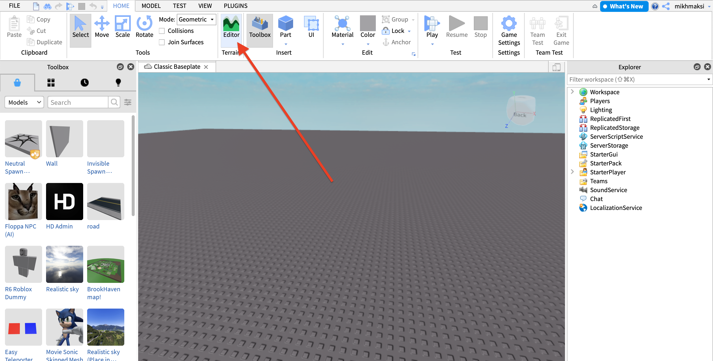

# Робота із ландшафтом та боками
В даному уроці ми познайомимся із тим як генерувати ландшавшт та виставляти елементи із тулбоксу.
## Генерація ландшафту
Для початку роботи зайдемо в типу шаблоні Clasic Baseplate
  

Увімкнемо редактор генератору ландшафту (Editor)  
   

Натиснемо кнопку **generate**
  

За бажанням - ви можете обрати составні частини вашого майбутнього ландшафту.
  

Після вибору елементів натисніть кнопку **generate**
  

Відбудеться автоматична унікальна генерація ландшафту для вашої гри
  

## Зміна ландшафту
Для того, щоб почати зміни ландшафту необхідно перейти до вкладки **Edit**
  

Для створення холмів (піднесення рівня землі) ми можемо використовувати кнопку **grow**
  

  
  

Для створення впадин (зниження рівня землі) ми можемо використовувати кнопку **erode**
  

Після роботи із ландшафтом мі можемо закрити відповідний редактор:
  

Для роботи із тулами відкриємо toolbox, для цього натиснемо на верхній панелі відповідну кнопку 
  

В рядку пошуку, наприклад, знайдемо школу (school), натиснемо на відповідну піктограмку та відповідна модель з'явиться на екрані
  

Для більш зручного пересування моделей по робочому полю існує механізм перемішення за допомогою стрілок за вимірами, для його увімкнення натисніть кнопку **move** на головній панелі та оберіть ту модель, яку ви бажаєте переміщувати.
  