# Використання 3D-моделей в Roblox
В Roblox можна імпортувати моделі як з сервісів створення 3D-моделей, а також тих, що знаходяться в каталогах 3D-моеделй.

## Tinkercad
Зареєструємося на сервісі Tinkercad https://www.tinkercad.com/  
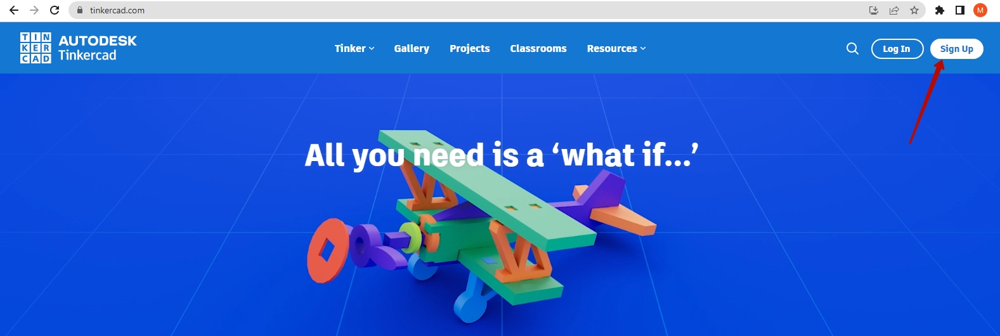  
Створимо новий акаунт:  
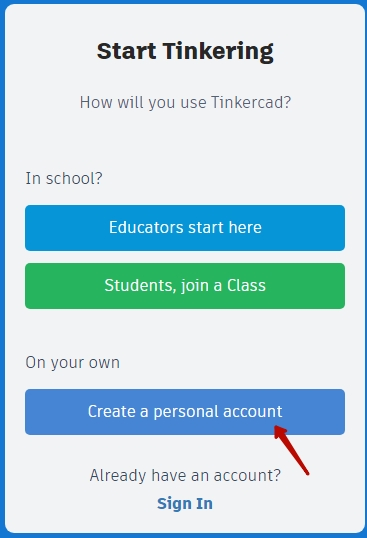  
Авторизуємося із використанням Google акаунту  
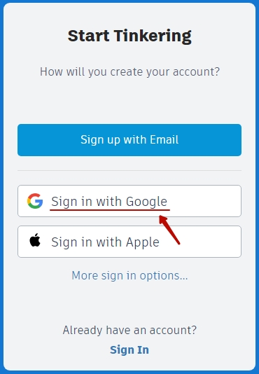  

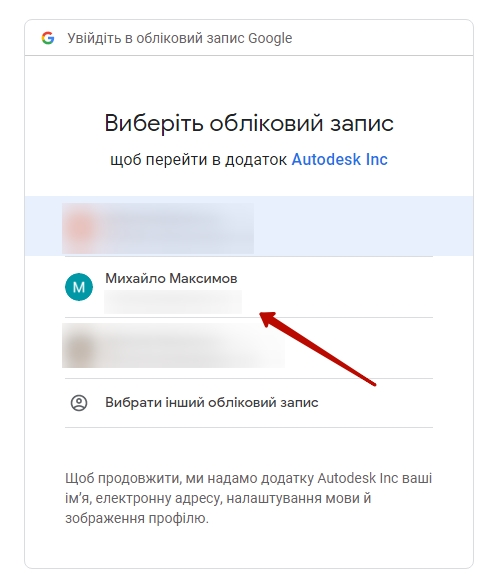  
Введіть дату народження:  
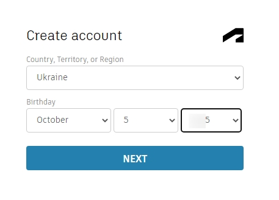  

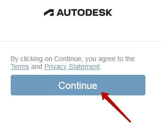  
Оберемо навчальну модель:  
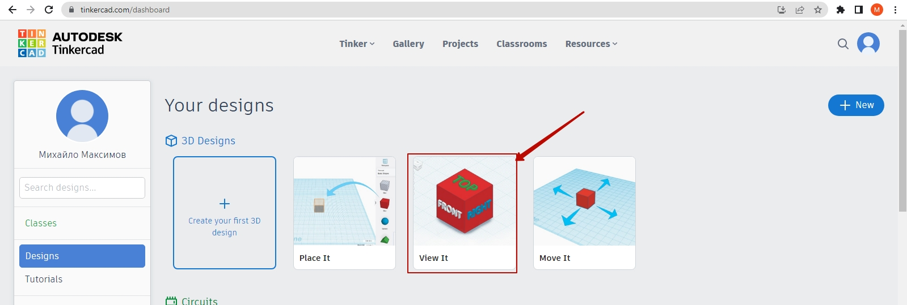  
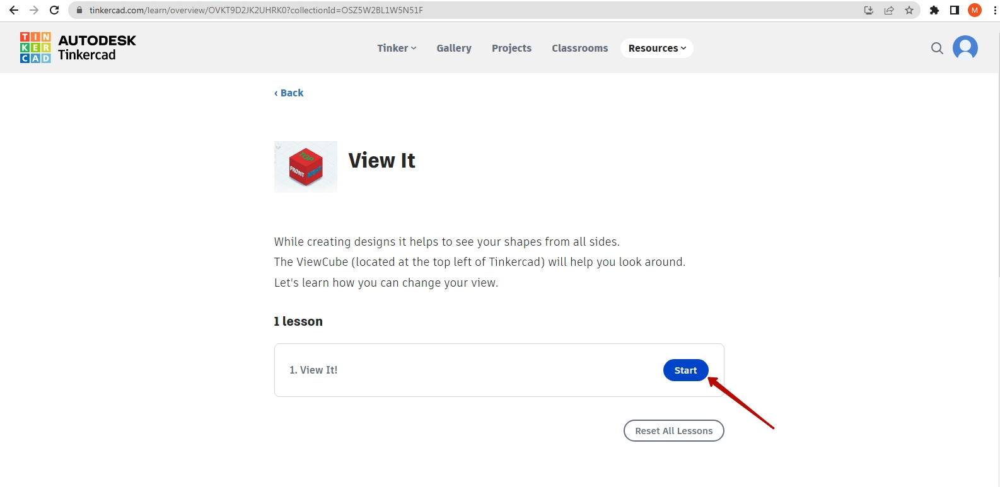  

Експортуємо обрану модель:  
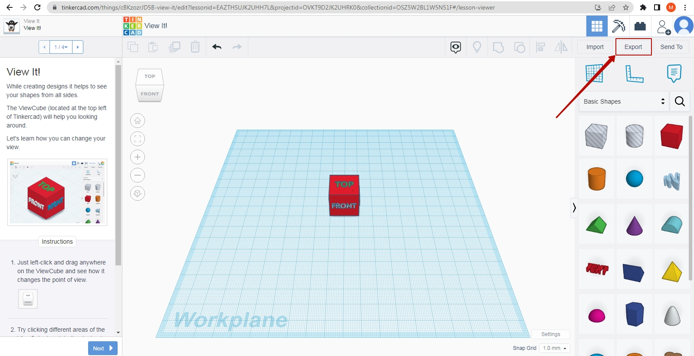  

Оберемо формат експорту **.obj**  
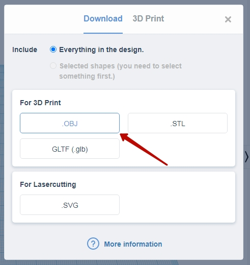  

Буде скачано архів:
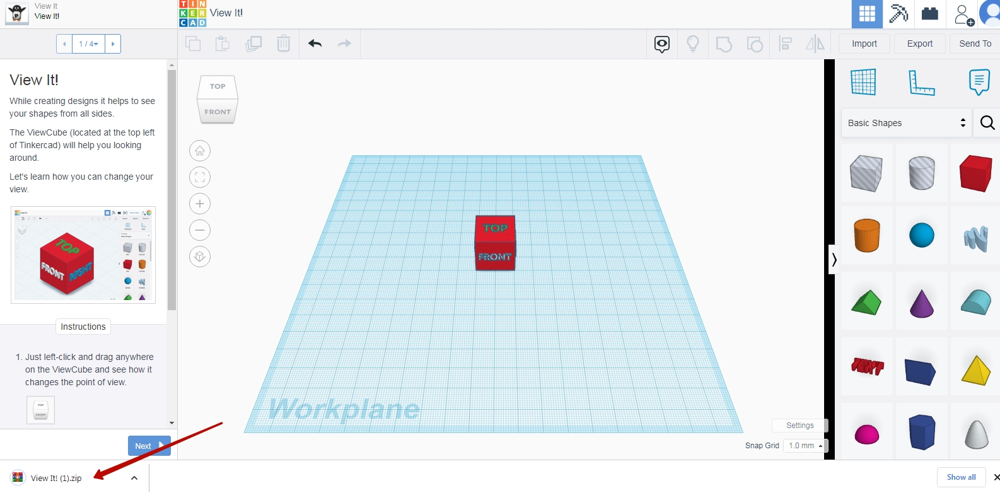  
  
Розпакуємо архів в папку  
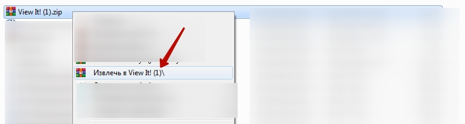  
Зайдемо до створеної папки:  
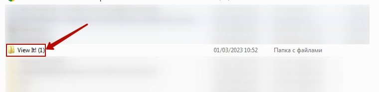  

Нам знадобиться файл із розширенням **.obj**
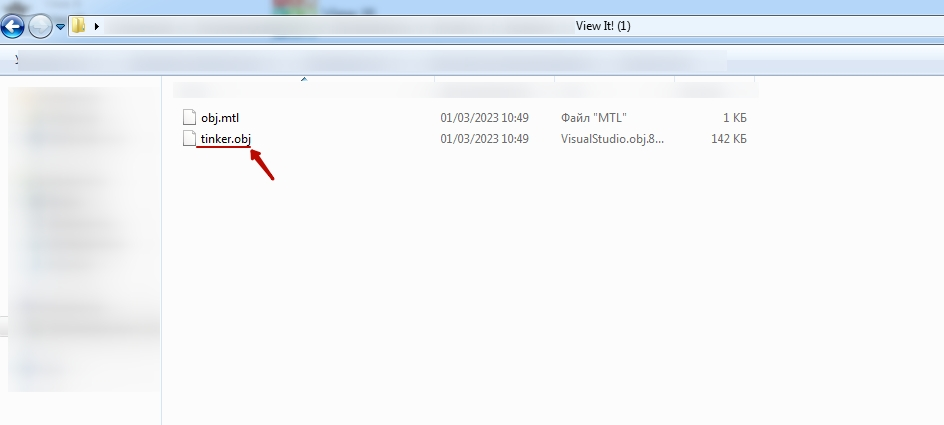  

## Імgорт скачаної моделі в Roblox
Створимо світ із темою Classic Baseplate
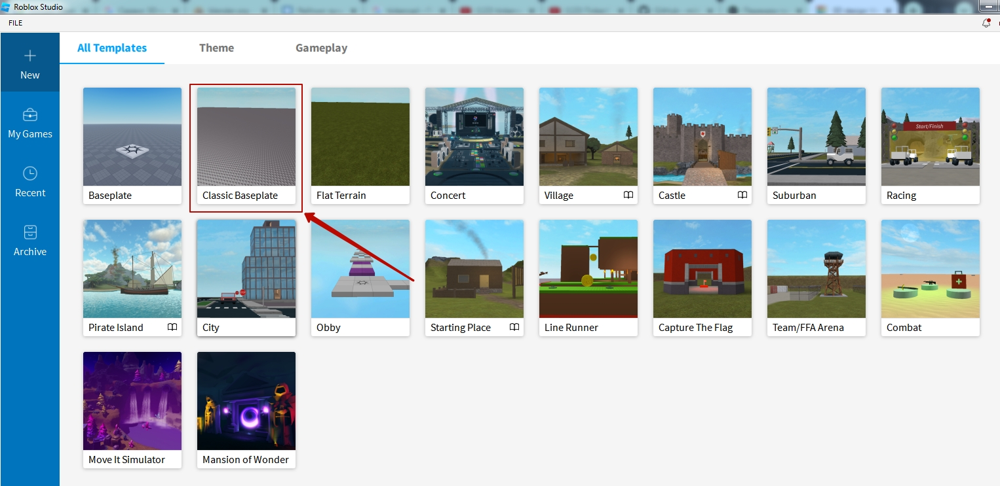  
Вставимо об'єкт  
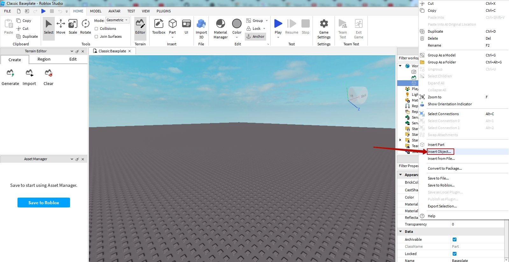  

Оберемо тип об'єкту **MeshPart**  
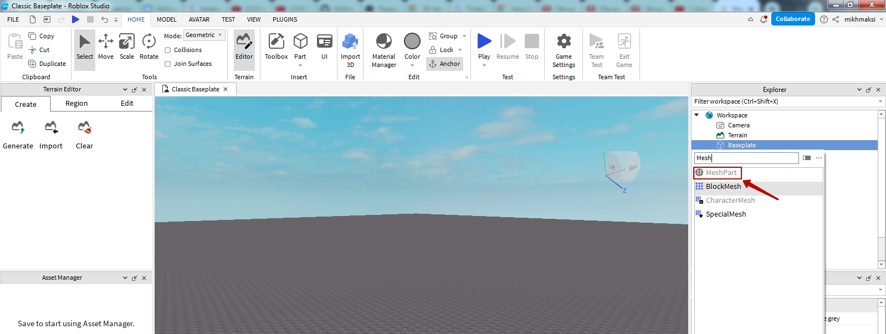  

Імпортуємо скачаний об'єкт з сервісу TinkerCad як форму для об'єкту.  
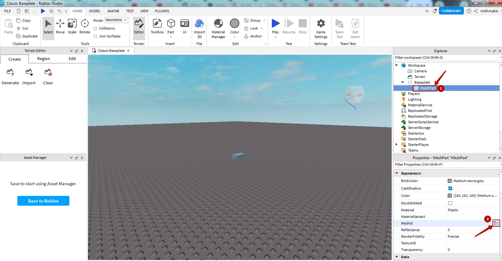  
Оберемо об'єкт, що його було вами скачано до цього  
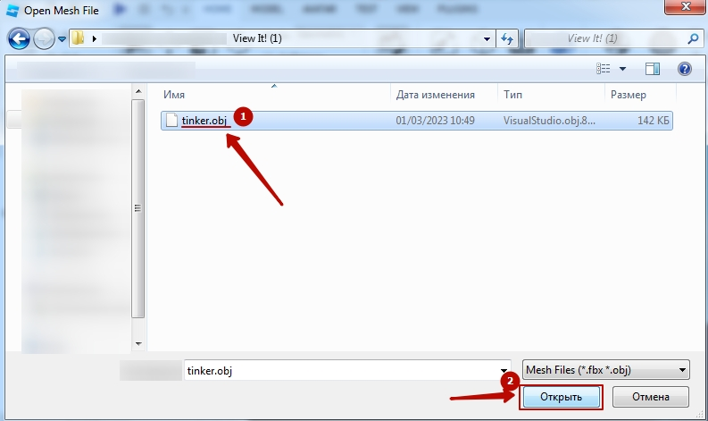  

Погодимося із вікнами, що відриються  
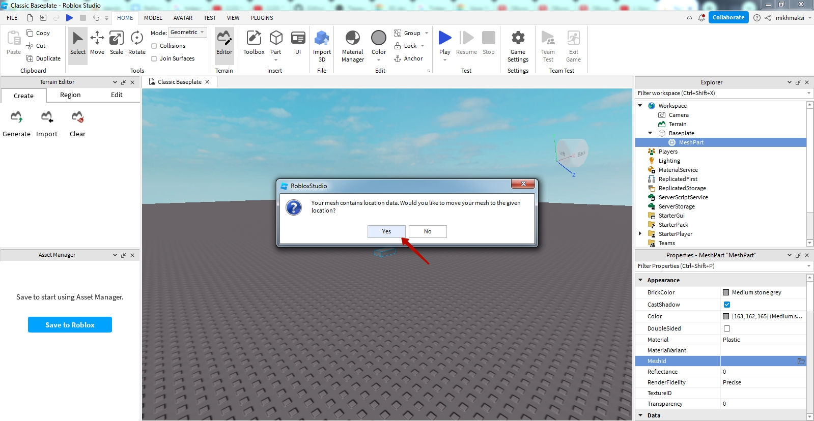  
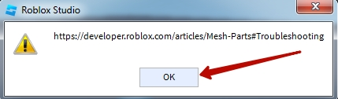  

Отримаємо імпортований об'єкт:  
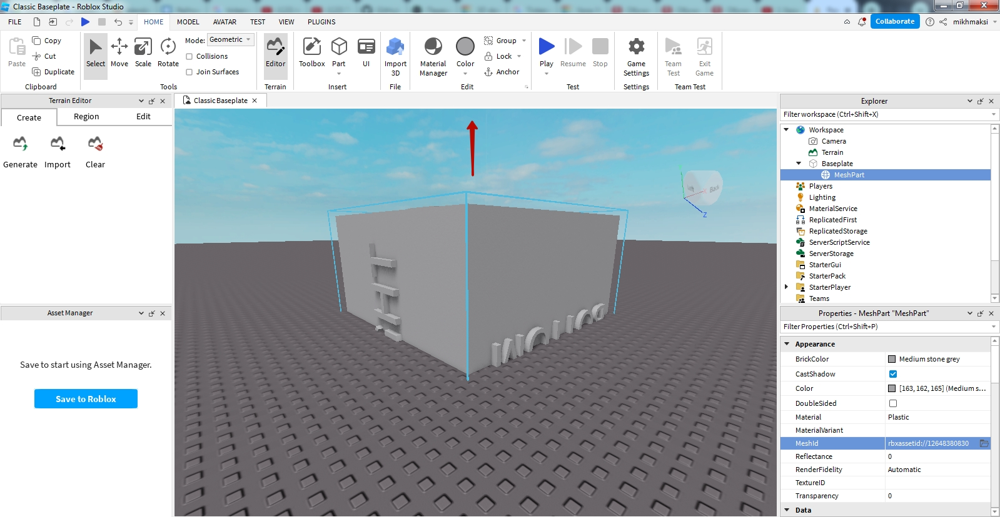  
  
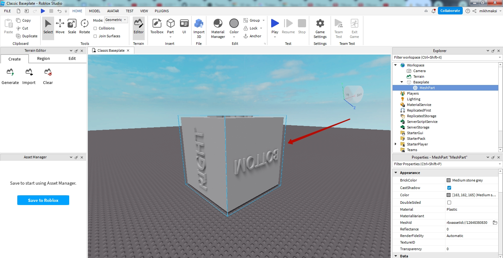  

## Завдання на створення гри.
1. Створіть гру з таким описом: 
* на карті з'являються геометричні об'єкти (коло, квадрат, прямокутник, куб, шар, тощо) певного кольору та розміру
* об'єкти для появи - створіть в редакторі TinkerCad
* Об'єкти створюються групами по 3, а також з'являється вказівка - до якого об'єкту необхідно доторкнутися.
* За торкання вірного об'єкту гравцю нараховуються бали, за торкання невірного об'єкту - бали знімаються

## Відгуки на гру
1. Опублікуйте гру на сервері Roblox.
2. Перешліть посилання на створену гру іншим студентам в вашій групі.
3. Попросіть їх пограти, та надати власні зауваження.
4. Внесіть зміни, за результатами зауважень гравців.
